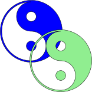

# svgSCAD
Build colored SVGs with units using the OpenSCAD 2D subsystem.

# Motivation
OpenSCAD can export SVGs of a 2D creation.
However, the default output is lightgray with a black border.
Furthermore, there are no units associated with the output SVG.

For laser cutting purposes, units need to be specified.
Colors can also be used to indicate etching, cutting, etc.

For SVG images, colors are part of the aesthetic.

svgSCAD tries to address both of these issues.

# Example
Here is the source code to build a combination yin-yang image:

https://github.com/SmoothDragon/svgSCAD/blob/main/YinYang.scad

